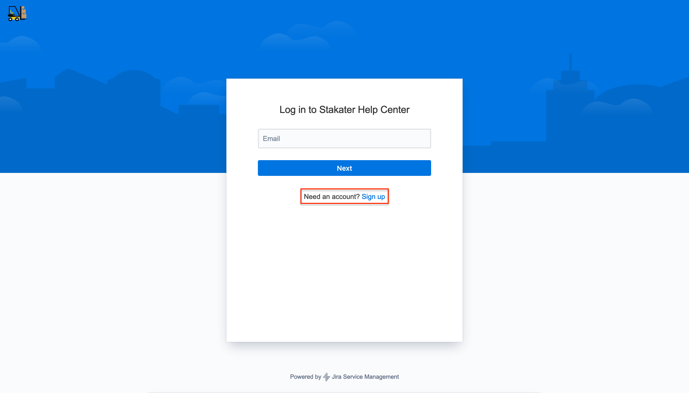
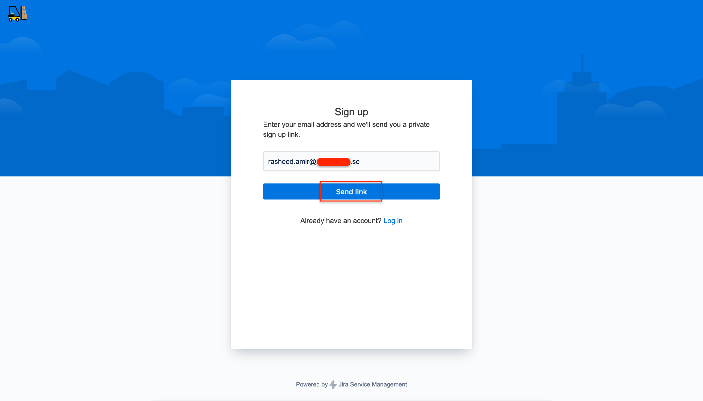
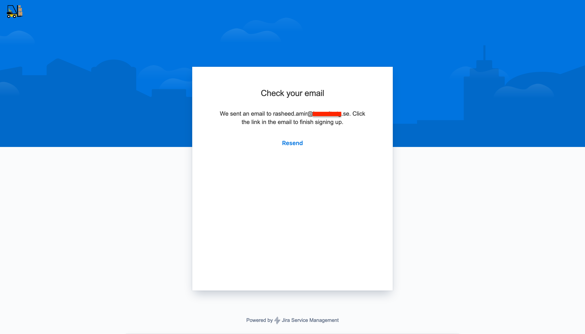
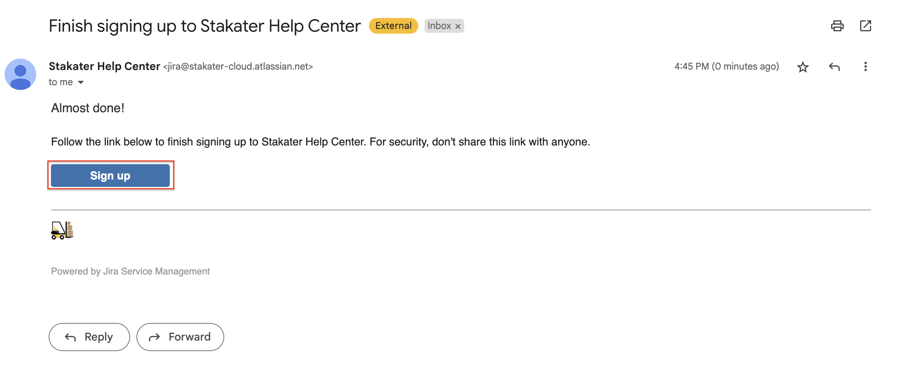
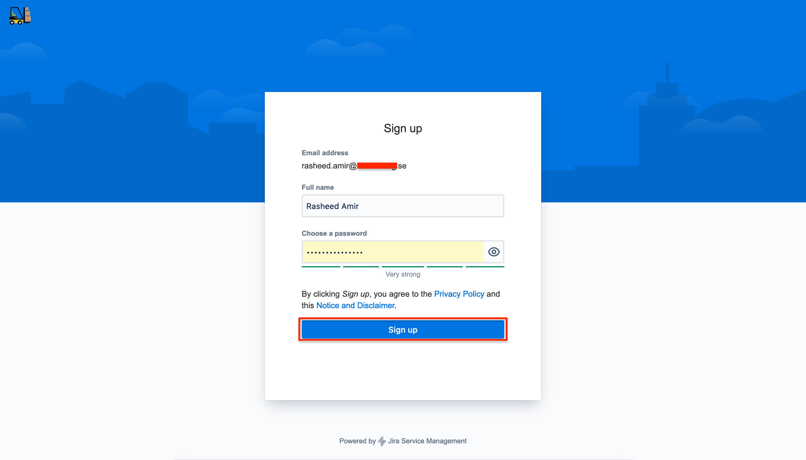
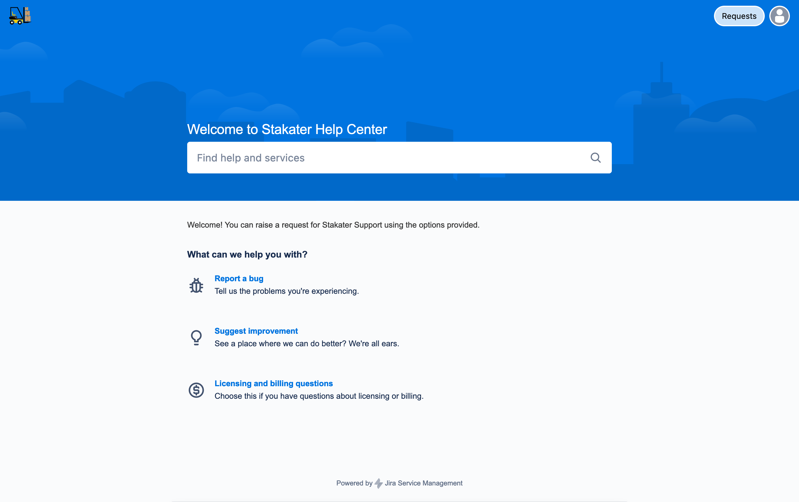

# Support

Stakater provides support to our customers via our [Service Desk Portal](https://stakater-cloud.atlassian.net/servicedesk/customer/portals).

## Sign Up

New users can sign up using their official email address by following this process:

1. Go to the [Service Desk Portal](https://stakater-cloud.atlassian.net/servicedesk/customer/portals)

2. Click on **Sign up**

    

3. Enter your official email address and click **Send link**

    

    You will be then redirected to following page

    

4. Check your email and click **Sign up**

    

5. Provide your full name, strong password and then click **Sign up**

    

## Request Support

As a registered user you can go to the [Service Desk Portal](https://stakater-cloud.atlassian.net/servicedesk/customer/portals) to raise a support request.

## Priorities

You as a customer can set the initial priority for a Request by specifying the appropriate priority: `Critical`, `High`, `Medium` or `Low`. The Engineer on Duty has the right to adjust it at their own discretion based on the rules below:

Request Priority | Description of the Request Priority
--- | ---
`Critical` |  Large-scale failure or complete unavailability of OpenShift or Customer's business application deployed on OpenShift. The `Critical` priority will be lowered to `High` if there is a workaround for the problem. Example: Router availability issues, synthetic monitoring availability issues.
`High` | Partial degradation of OpenShift core functionality or Customer's business application functionality with potential adverse impact on long-term performance. The `High` priority will be lowered to `Medium` if there is a workaround for the problem. Example: Node Group and Control Plane availability problems.
`Medium` | Partial, non-critical loss of functionality of OpenShift or the Customer's business application. This category also includes major bugs in OpenShift that affect some aspects of the Customer's operations and have no known solutions. The `Medium` priority will be lowered to `Low` if there is a workaround for the problem. This priority is assigned to Requests by default. If the Request does not have an priority set by the Customer, it will be assigned the default priority `Medium`. Example: Problems with the monitoring availability and Pod autoscaling.
`Low` | This category includes: Requests for information and other matters, requests regarding extending the functionality of the Kubernetes Platform, performance issues that have no effect on functionality, Kubernetes platform flaws with known solutions or moderate impact on functionality. Example: Issues with extension availability.

## Production Support Terms of Service

Request Priority | Initial Response Time | Ongoing Response
--- | --- | ---
`Critical` | 2 business hours | 2 business hours or as agreed
`High` | 4 business hours | 4 business hours or as agreed
`Medium` | 2 business day | 2 business days or as agreed
`Low` | 5 business days | 5 business days or as agreed

## Initial Response Time and Our Commitment to You

Once we've addressed your initial support request, our commitment doesn't end there. We believe in providing continuous support to ensure that your issue is resolved satisfactorily. Our ongoing response framework is designed to keep you informed and confident that we're working diligently to address your needs.

## Support Channels

We use various communication channels to keep you updated

- Email: For documenting and providing detailed updates and progress reports
- Phone Calls: When immediate or more personal communication is necessary
- Chat: For quick, real-time interactions during troubleshooting, foremost Slack
- Support Portal: Where you can log in at any time to view the latest updates, add information or ask questions

## Hours of Availability

The support engineering team are normally available on business hours or as agreed in a support contract.
Business hours are always viewed with the Central European Timezone, hours may vary with summer and winter time.

Active business hours, unless otherwise stated: 06:00 to 18:00

## Ongoing Response

Depending on severity of your issue we will keep you in the loop and inform you of our progress. With high severity cases we would also provide our next steps as well as next follow up, either via the support engineering team or, if applicable, via your designated customer success manager.
Preferred method of contact is stated in your support contract or otherwise through any of the stated communication channels.

## Proactive Support

Our engineering support team doesn't just react to issues; we anticipate and work proactively to prevent them. We'll analyze trends, provide recommendations and in some cases, implement preventative measures to avoid future disruptions.

## Feedback Loop

Your feedback during and after the resolution process helps us improve. We'll check in with you to ensure your satisfaction and learn how we can enhance our support.

## Resolution and Review

Once an issue is resolved, we'll conduct a review with you to ensure everything is working as it should. We’ll also discuss any lessons learned and potential improvements for both parties.

## Our Promise

We are here to support you, not just until the problem is solved, but to ensure that your experience is as seamless as possible. Your success is our success and through our ongoing response efforts, we pledge to uphold the highest standards of customer service and satisfaction.
