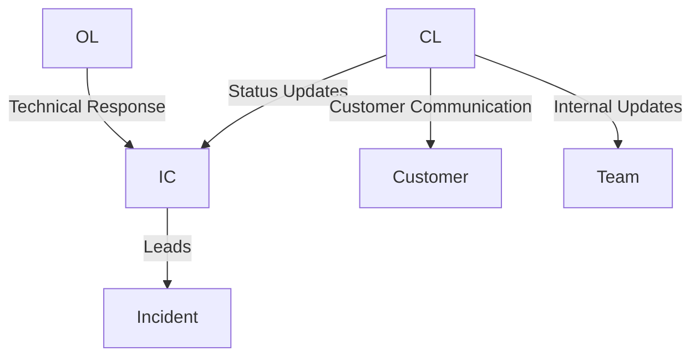

# Incident Response Management

Stakater follows a structured Incident Response Management (IRM) process to ensure swift, coordinated resolution of service disruptions.

Our approach is inspired by industry best practices, including Google’s Incident Management System (IMS), and is adapted to fit Stakater’s operational model.

The primary goal of incident management is to restore service stability as quickly and safely as possible while maintaining clear communication and accountability.

## 1. What Is an Incident?

An incident is any unplanned event that:

* Causes service degradation or outage, or
* Has the potential to impact customer SLA or production stability

Incidents require immediate attention and structured coordination.

## 2. Incident Authority & Ownership

The Stakater SRE team has both the responsibility and the authority to manage and resolve incidents.

By default, the **SRE on-call engineer** assumes ownership of the incident until roles are formally assigned.

Ownership may be transferred during shift handover while maintaining continuity.

## 3. Incident Management Principles

Our incident management process ensures:

* Clearly defined roles and responsibilities
* Structured communication channels
* Controlled information flow
* Coordinated technical response
* Root cause analysis and follow-up actions

The focus during an incident is restoration of service — not assignment of blame.

## 4. Incident Roles & Responsibilities

Clear role separation ensures focus and efficiency during critical situations.

### 1. Incident Commander (IC)

Leads and coordinates the incident response.

Responsibilities:

* Declares and classifies the incident
* Defines impact and severity
* Assigns roles
* Coordinates response efforts
* Escalates internally as needed
* Ensures structured handover if required

### 2. Communications Lead (CL)

Reports to the Incident Commander.

Responsibilities:

* Acts as primary communication interface
* Provides structured updates to customers
* Coordinates internal status reporting
* Manages inbound inquiries during incident

### 3. Operations Lead (OL)

Reports to the Incident Commander.

Responsibilities:

* Investigates technical root cause
* Applies operational tools and mitigation strategies
* Coordinates with engineering teams
* Executes remediation actions

One individual may assume multiple roles depending on incident size and team availability.

## 5. Incident Declaration Criteria

An incident is formally declared if any of the following apply:

* Production workloads are affected
* Customer SLA may be impacted
* Service stability is at risk

Formal declaration triggers role assignment and structured communication.

## 6. Standard Operating Procedure (SOP)

When an incident occurs:

1. Notify the SRE on-call engineer.
2. Assign Incident Commander (IC).
3. IC defines:
   * Impact
   * Scope
   * Severity (P1–P4)
4. Create an Incident ticket in the support system.
5. Assign Communications Lead (CL) and Operations Lead (OL).
6. Begin structured investigation and mitigation.
7. Provide periodic customer updates (frequency based on severity).
8. Escalate internally if required.
9. Maintain role continuity during shift transitions.

The primary objective is to restore service as quickly as possible.

## 7. Communication During Incidents

Communication cadence depends on severity level:

* **P1 – Critical:** Frequent updates until service stability is restored.
* **P2 – High:** Regular progress updates during active investigation.
* **P3 / P4:** Updates aligned with SLA response framework.

Communication occurs through agreed customer channels and is logged in the Support Portal.

## 8. Resolution

An incident is considered resolved when:

* Service functionality is restored, or
* A verified workaround is implemented, or
* The issue is mitigated and no longer impacts SLA

The Incident Commander confirms resolution before formal closure.

## 9. Post-Incident Review (Post-Mortem)

For significant incidents, a structured post-incident review is conducted.

This includes:

* Timeline reconstruction
* Root cause analysis
* Identification of contributing factors
* Definition of follow-up actions
* Preventative recommendations

Follow-up actions are tracked to completion.

The purpose of the post-mortem is continuous improvement — not fault attribution.

## 10. Continuous Improvement

Incident data is used to:

* Improve operational processes
* Enhance monitoring and alerting
* Strengthen platform resilience
* Reduce recurrence risk

Stakater continuously refines its incident response practices to maintain operational excellence.
