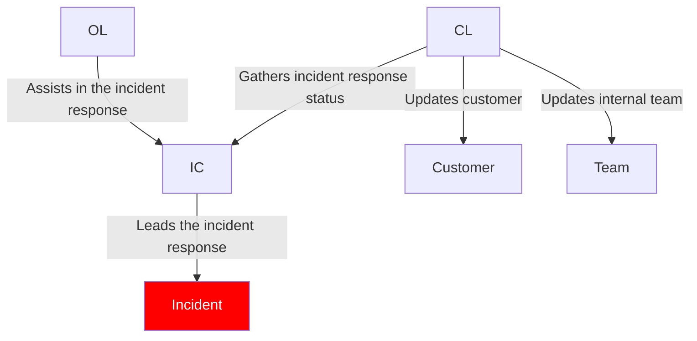

# Incident Response Management

The SRE team at Stakater has both the responsibility and the authority to resolve incidents.

Incidents are anomalous conditions that result in — or may lead to — service degradation or outages. These events may require human intervention to avert disruptions or restore service to operational status. Incidents should always be given immediate attention.

Stakater's incident management system (IMS) is based on [Google's IMS](https://sre.google/sre-book/managing-incidents/).

The goal of incident management is to organize chaos into swift incident resolution. To that end, incident management provides:

1. Well-defined roles and responsibilities and workflow for members of the incident team
1. Control points to manage the flow information and the resolution path
1. A root cause analysis where follow-up actions, lessons, and techniques are extracted and shared

## Tools

Tools used to facilitate incident management at Stakater:

* `Alertmanager` - for creating alerts from Prometheus
* `Grafana OnCall` - for paging of alerts
* `Slack` - for asynchronous communication
* `Google Meet` - for synchronous communication

## Incident Ownership

By default, the SRE on-call is the owner of the incident.

## Roles and Responsibilities

Clear role responsibilities is important during an incident. Quick resolution requires focus and a clear hierarchy for delegation of tasks. The focus of incident response should be on resolving the incident, not on resolving confusion on who should do what - clear roles and responsibilities prevent confusions around accountability when an incident actually happens.

The three main roles in incident response are:

1. Incident Commander (IC) - leads the incident response
    * Commands and coordinates the incident response
    * Assumes all roles that have not been delegated yet
    * Communicates effectively
    * Escalates alerts: Notifies the team until someone acknowledges the alert and takes on the CL role
1. Communications Lead (CL) - reports to the IC
    * Public face of the incident response team
    * Provides periodic updates to customers and the incident response team
    * Manages inquiries about the incident
1. Operations or Ops Lead (OL) - report to the IC
    * Responds to the incident by applying operational tools to mitigate or resolve the incident

One person can be assigned to one or multiple roles. The most important thing is that all roles are needed to effectively deal with an incident.

## SOP (Standard Operating Procedure) for an Incident

An incident should be declared if any of the following is true:

* Does the incident affect customers?
* Does the incident affect the customer SLA?

To resolve an incident:

1. Make SRE on-call aware of the incident
1. Assign incident management roles
1. IC defines the incident in terms of:
    * Impact
    * Frequency
    * Severity
1. IC creates an `Incident` ticket for the incident in the Stakater ticket system
1. CL informs the customer and keeps them updated every hour of the progress
    * Inform customer in external customer Slack channel
    * Inform customer via email and add their manager on CC
1. IC and OL begins understand why it happened
    * Always replicate issues with incognito user to avoid using cached content
1. IC and OL begins address it by involving other teams
1. IC and OL hands over the ownership when needed if their shifts end
1. CL creates a document to start analyzing the root cause

To do a post-mortem of an incident:

1. CL informs the customer that the incident is resolved
1. IC schedules a root cause analysis meeting, where every involved attends and collaboratively fills out the incident document
1. IC creates sub-tasks in the incident ticket for follow-up actions
