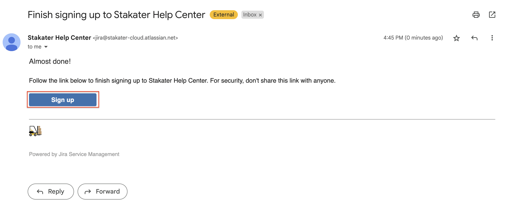
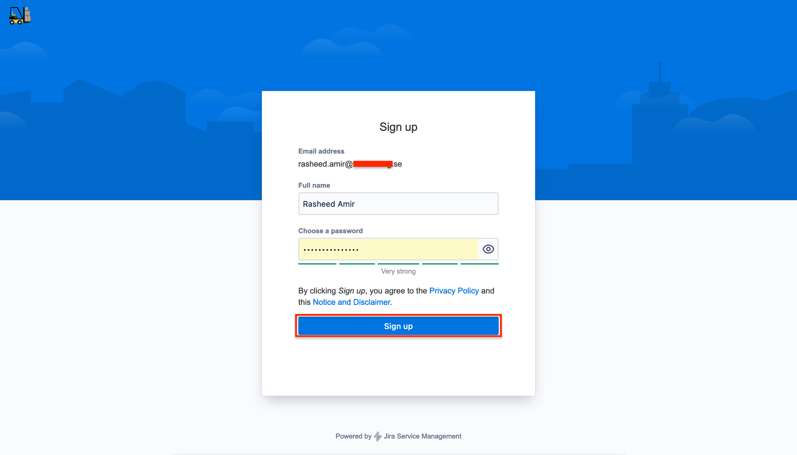

# Sign Up

New users can sign up using their official email address by following these steps:

1. Go to the [Service Desk Portal](https://stakater-cloud.atlassian.net/servicedesk/customer/portals)

1. Click on **Sign up**

    

1. Enter your company email address and click **Send link**

    

    You will be then redirected to following page

    

1. Check your email and click **Sign up**

    

1. Provide your full name, strong password and then click **Sign up**

    

## Request Support

As a registered user you can go to the [Service Desk Portal](https://stakater-cloud.atlassian.net/servicedesk/customer/portals) to create a support request.

## Share Request

Only you as a creator of a request are permitted to view your request by default. To share a request with another user:

1. As the creator of the request, visit the request page
1. Specify in the `Shared with` section the email of the other user that you would like to share the request with
